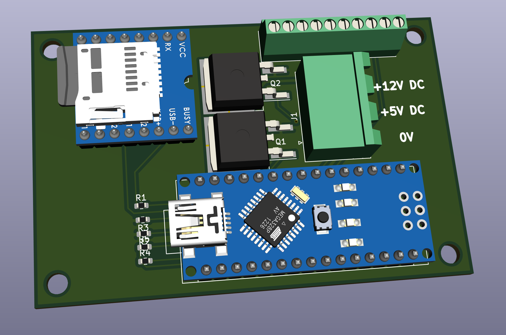

An effects board for light, motion, and sound
=============================================

### larsskj-008

This board is basically a wrapper to provide an easy interface to an Arduino Nano, a DFPlayer Mini, and some support circuitry. It provides two inputs for the Arduino, outputs for a speaker, and two FET controlled outputs for LEDs and/or motors.

If you just need input and sound, the setup can run directly from USB power supplied to the Arduino. Otherwise there's a terminal block that allows supply of 5V DC for the Arduino and the DFPlayer. It also allows for a 12V DC supply that will drive the FET outputs - it can actually be just about any reasonable voltage and isn't restricted to 12V. 

I use the board to emit sounds and control moving chickens for a henhouse, and for controlling light, sound, and servos for a railway crossing. 

For more information, visit the [project homepage](https://larsskj.org/projects/larsskj-008).

The files provided are project files for [KiCad 5](http://kicad-pcb.org/).

